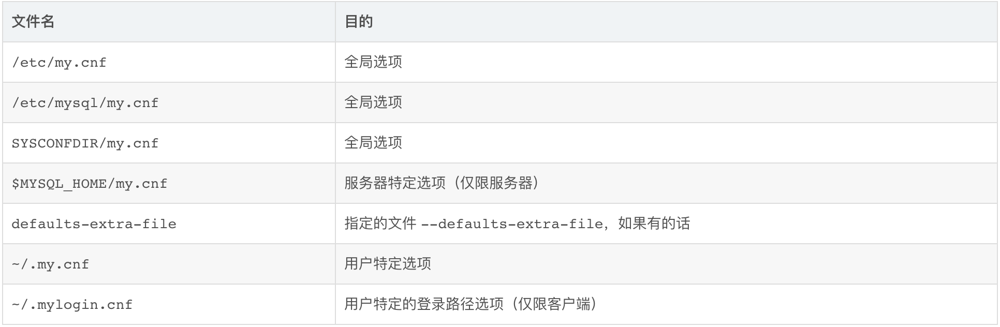

## 一、环境搭建

### 1.1 homebrew

1. 国内源

安装: /bin/zsh -c "$(curl -fsSL https://gitee.com/cunkai/HomebrewCN/raw/master/Homebrew.sh)"

卸载: /bin/zsh -c "$(curl -fsSL https://gitee.com/cunkai/HomebrewCN/raw/master/HomebrewUninstall.sh)"

2. 官网

[homwbrew官网下载](https://brew.sh/)

### 1.2 golang

brew install golang

#### 1.2.1 tips

| 命令   | 说明               | 备注                 |
| ------ | ------------------ | -------------------- |
| go env | 可以查看go环境变量 | GOPATH是个重要的参数 |

### 1.3 mysql

brew install mysql@5.7

```
# 安装
brew install mysql@5.7

# 启动
brew services restart mysql@5.7
```

#### 1.3.1 修改my.cnf

1. mysql 配置文件位置



2. 修改内容

```
[client]
port = 3306
socket = /tmp/mysql.sock
#;default-character-set = utf8

[mysqld]
port = 3306
socket = /tmp/mysql.sock
user = mysql
server-id = 1
log-bin = mysql-bin
log_slave_updates = on            #从服务器将时间记录到二进制日志中
auto_increment_increment=1        #自动增长的步长
auto_increment_offset=1

init-connect = 'SET NAMES utf8mb4'
character-set-server = utf8mb4
performance_schema_max_table_instances = 200
table_definition_cache=200
table_open_cache=128
#log_error = /usr/local/var/mysql/mysql-error.log

character_set_server=utf8mb4
collation_server=utf8mb4_unicode_ci
init_connect='SET NAMES utf8mb4'

bind-address = 0.0.0.0

skip-name-resolve
back_log = 600
max_connections = 1000
max_connect_errors = 6000
open_files_limit = 65535
max_allowed_packet = 20M
binlog_cache_size = 1M
max_heap_table_size = 8M
tmp_table_size = 16M
read_buffer_size = 2M
read_rnd_buffer_size = 8M
sort_buffer_size = 8M
join_buffer_size = 8M
thread_cache_size = 8
query_cache_size = 8M
query_cache_limit = 2M
key_buffer_size = 4M
ft_min_word_len = 4
transaction_isolation = REPEATABLE-READ

log_bin = mysql-bin
binlog_format = row
max_binlog_size = 104857600
expire_logs_days = 3
slow_query_log = 1
long_query_time = 1
#slow_query_log_file =/usr/local/var/mysql/mysql-slow.log
performance_schema = 0
explicit_defaults_for_timestamp
skip-external-locking
default-storage-engine = InnoDB
innodb_file_per_table = 1
innodb_open_files = 500
innodb_buffer_pool_size = 512M
innodb_write_io_threads = 4
innodb_read_io_threads = 4
innodb_thread_concurrency = 0
innodb_purge_threads = 1
innodb_flush_log_at_trx_commit = 2
innodb_log_buffer_size = 2M
innodb_log_file_size = 32M
innodb_log_files_in_group = 3
innodb_max_dirty_pages_pct = 90
innodb_lock_wait_timeout = 120
bulk_insert_buffer_size = 8M
myisam_sort_buffer_size = 8M
myisam_max_sort_file_size = 10G
myisam_repair_threads = 1
interactive_timeout = 28800
wait_timeout = 28800

[mysqldump]
quick
max_allowed_packet = 16M

[myisamchk]
key_buffer_size = 8M
sort_buffer_size = 8M
read_buffer = 4M
write_buffer = 4M
```

#### 1.3.2 创建账户/数据库

```
# 替换配置后重启
brew services restart mysql@5.7

# 无密码登录
mysql -u root 

# 创建账户
> CREATE USER 'bang'@'%' IDENTIFIED BY 'bang';
> GRANT ALL PRIVILEGES ON *.* TO 'bang'@'%' WITH GRANT OPTION;

# 查看用户
> SELECT user, host FROM mysql.user;

# 退出，使用 bang 用户登录并创建数据库
mysql -u bang -p

> create database project;
```

#### 1.3.3 导入数据(暂未使用)

```
mysql -u bang project -p < project_master_20200610.sql
```

### 1.4 redis

```
# 安装
brew install redis

# 启动
brew services restart redis
```

### 1.5 rabbitmq

```
# 安装
brew install rabbitmq

# 启动
brew services restart rabbitmq
```

#### 1.5.1 检查状态

```
sudo rabbitmqctl status
```

#### 1.5.2 界面管理

```
# 地址
http://localhost:15672/#/

# 默认账号/密码
guest/guest

# 用户
sudo rabbitmqctl add_user mqadmin mqadminpassword

# 管理员
sudo rabbitmqctl set_user_tags mqadmin administrator

# 权限
sudo rabbitmqctl set_permissions -p / mqadmin ".*" ".*" ".*"
```

## 二、IDE

### 2.1 vscode

#### 2.2.1 golandci-lint

```json
{
    "go.lintTool": "golangci-lint",
    "go.lintFlags": [
        "--vendor",
        "--disable-all",
        "--enable=vet",
        "--enable=vetshadow",
        "--enable=ineffassign",
        "--enable=deadcode",
        "--enable=gas",
        "--tests"
    ],
    "go.lintOnSave": "package"
}
```

### 2.2 goland

## 三、规范

### 3.1 git提交

#### 3.1.1格式

**commit-type: #ticket-number log**

eg:

> add: #110887 项目集列表支持排序

1. commit-type

根据提交内容，分为以下几种 commit 类型。每种类型在提交时需在 commit log 前添加相应关键字：

- add：添加功能，在有关联研发任务的情况下，需要加上关联的任务编号。
- fix：没有任务号，且不用加任务的修改。
- bug：修复缺陷，需要加上关联的任务编号。
- drop：移除不用功能或代码。
- bump：更新 common 库或者其它依赖库，需要说明具体更新的功能。
- refactor：代码重构，不改功能。
- optimize：优化性能，不改功能。
- other：不属于以上任何类型。

2. #ticket-number

关联系统中的任务单号。

3. log

每一行描述一件事，每一行开头都有类型前缀。如果修改源文件属于 1-5 中的类型，则必须为每一件事写一行描述。如果做 1-5 类型修改的同时，也做了 6-8 类型的修改，可以省略掉 6-8 类型的描述。

如果实在无法分批 commit（比如两种类型的修改，集中在一个 file 内），则要考虑分多行编写。

#### 2.1.2 规范

1. 尽量保证一次 commit 仅包含一种 commit 类型。如果一次修改的文件包含多种类型，则可以考虑分批 commit，每次只 commit 一部分。
2. 严格按照如下示例来写，关键字（全小写），后面加半角冒号，在后面加半角空格，最后是提交内容。
3. add 和 bug 类型的提交，原则上必须加上任务编号。

### 3.2 review

#### 3.2.1 代码风格

必需配置 lint  格式化插件，由组件完成统一风格的规范
函数传入/返回参数比较多时，换行处理，每行一个参数
函数封装，如果函数功能很少，只有几行代码，又无多次引用 ，考虑就地解决

#### 3.2.2 命名规范

函数内变量使用驼峰，首字母小写，变量名选择尽量贴合场景
import  包名，如果使用别名，规则与现有的一致

#### 3.2.3 数据一致性

永远不信任客户端的传入的数据，需要做严格的校验

#### 3.2.4 性能影响

map[string]bool 等用来表达 SET 数据结构，优先使用 map[string]struct{} ，减少空间使用
初始化列表等结构，如果可以提前确定长度，则优先提前确定，一次性分配好内存
字符串拼接，循环操作内等情况，会引起频繁的内申请与释放操作，如果用来做map key,可以使用结构处理。
拼接数量多等情况，考虑使用 buffer  实现

#### 3.2.5 bang.sql

涉及到这个文件的结构变更，要使用 scripts/merge_bang.sh 自动实现结构变更 ，人工容易错漏

#### 3.2.6 功能实现

功能实现首先必需是正确

#### 3.2.7 其它

 名称字段长度与拼音字段长度，后者为前者4倍

### 3.3 分支管理

分支名称规范：迭代名 或 迭代名_特性，中间以下划线分割

#### 3.3.1 master

生产环境分支，不能往这里提交代码

#### 3.3.2 feature[Fxxx]

新的功能由该feature负责人创建相关分支，在该分支中进行开发(例如F1000)

提交代码后CI将自动部署（大概几分钟）

#### 3.3.3 hotfix [hotfix_xxxxxxxx]

当发现线上环境有相关问题时，应该创建hotfix分支(例如 hotfix_20191211)

代码提交后如上所述，CI将自动部署

#### 3.3.4 commit

描述清楚commit中的意图
如果你开发的功能在 ones.ai 中有相关任务，提交commit时，最好带上该任务ID，并更新任务状态
保持每天从master分支往自己的分支合并代码

### 3.4 错误处理

#### 3.4.1 处理规范

1. 所有需要返回错误的地方，都应该使用 go 自带的 error 接口，而不是自定义数据结构。

```go
// bad
func DoSomething() *errors.Err

// good
func DoSomething() error
```

2. 产生错误时，应该使用 errors 里面的方法，一开始就指定好错误类型。

```go
// bad
t, ok := value.(string)
if !ok {
    return fmt.Errorf("type mismatch: %v", t)

}

// good
t, ok := value.(string)
if !ok {
    return errors.TypeMismatchError(t, "string")

}
```

3. 由系统库或者第三方库产生的错误，应该第一时间用 errors 包装，指定错误类型。

```go
// bad
_, err := tx.Exec(sql)
if err != nil {
    return err
}

// good
_, err := tx.Exec(sql)
if err != nil {
    return errors.Sql(err)

}
```

4. 向上层原样传递错误时，应该使用 errors.Trace 方法记录错误在当前层的栈信息。

```go
// bad
if err := DoSomething(); err != nil {
    return err
}

// good
if err := DoSomething(); err != nil {
    return errors.Trace(err)
}
```

5. 需要用新的错误替换掉原来的错误时，应该使用 errors.Wrap 方法包装原来的错误。

```go
// bad
t, err := ContextTypeByLabel(label)
if err != nil {
    return errors.InvalidParameterError(
        errors.PermissionRule, errors.Context, errors.InvalidType)
}

// good
t, err := ContextTypeByLabel(label)
if err != nil {
    return errors.Wrap(err, errors.InvalidParameterError(
        errors.PermissionRule, errors.Context, errors.InvalidType))
}
```

6. 错误应该尽可能准确、详细。

```go
// bad
if page.Title == "" || len(page.Title) > 30 {
    return errors.InvalidParameterError(errors.Page, errors.Title, "")
}

// good
if page.Title == "" {
    return errors.MissingParameterError(errors.Page, errors.Title)

}
if len(page.Title) > 30 {
    return errors.InvalidParameterError(errors.Page, errors.Title, errors.TooLong)
}
```

#### 3.4.2 错误处理tips

1. 每种错误都会默认绑定一个 http 状态码，比如 InvalidParameter 对应 400，PermissionDenied 对应 403。可以使用 errors.HttpStatus 方法获取错误对应的状态码，也可以使用 errors.WithStatus 方法直接指定错误的状态码。
2. 可以使用 errors.WithDesc 方法更换已有错误的描述。
3. 可以使用 errors.WithValue 和 errors.WithValues 方法给错误加上额外的自定义字段，这些字段会作为 response 的第一层属性返回给客户端。

#### 3.4.2 错误排查

##### 3.4.2.1 排查原则：

* warning 当成 error 处理，任何 warning 都需要重视
* error 不能容忍，sentry 一旦发现问题，尽快解决
* 禁止防御性修改 error，任何问题始终需要分析找到原因进行处理

##### 3.4.2.2 Dev 环境错误排查步骤

1. Chrome devtools 获取请求相关信息，确认请求参数和返回结果是否符合预期
2. Dev 服务器获取服务端 log ，找到对应的错误 log，根据 log 排查代码问题
3. 如果和配置相关，找到对应的分支配置存放地址
4. 如果和 ES 相关，则查看 Dev 服务器上的 ES log

##### 3.4.2.3 线上环境或私有部署错误排查步骤

1. 通过 sentry 、线上 API log 或 私有部署 API log确认错误信息
2. 分析代码反向推导 Bug 的成因，如需要更多的信息，则准备好所有的可能性，一次性跟销售获取更多的帮助信息。
3. 分析原因，找到重现步骤，在 Dev 环境重现
4. 修复 Bug

### 3.5 数据库相关

#### 3.5.1 mysql

##### 3.5.1 表名

1. 数据 model 的表名需要与代码中的命名保持一致，使用**下划线命名法。**
2. 不会在 model 里直接体现的关联表，有实际含义的情况下按照含义命名，比如 user_group_member、field_config；没有实际含义的情况下，按照关联的先后顺序（一对多时「一」在前面）命名，比如 task_commit。

##### 3.5.2 索引

1. 任何需要使用并且作为查询条件的都需要加索引
2. 使用联合索引时，主要索引的顺序，保证索引的命中
3. 有 uuid 作为主键，无 uuid 需要考虑什么字段的组合能够成为唯一性标识，并将其设置为复合主键

##### 3.5.3 注释

枚举值说明，字段说明

##### 3.5.4 字段名

* uuid 主键名，8字节
* owner 创建者，所有者
* assign 负责人
* name 名称
* category 与 status 状态分开，分别描述“数据库中的状态”与“数据状态”
* create_time 数据创建时间
* update_time 数据更新时间
* {action}_time 时间状态相关的都以_time结尾（eg. complete_time, open_time 等等）
* deadline 截止时间
* number 编号
* desc 描述
* parent_uuid 父级

**以上为常见的确定的命名，不仅限于这些，更多的需要参照已经建好的表结构**

**另外，有历史遗留问题的情况，在新设计的时候不再采用，主要包含**

**summary, title: 统一更改为 name**

##### 3.5.4 假删除

1. 需要的场景

   1. 某用户退出了项目，但是一些工作项的内容曾经是由他添加的，查询的时候还需要查询出来
2. 不需要的场景

   1. 配置相关
   2. 关联关系

##### 3.5.5 拼音长度

因为项目中需要排序等功能，所以很多名称都加入了字段eg: name_pinyin

**拼音字段属性的长度应该是名称属性的8倍**

eg: name varchar(10), name_pinyin varchar(80)

#### 3.5.2 redis

##### 3.5.2.1 键

1. 键设计需要满足「用途:团队uuid:HASH」的形式
2. 需要考虑缓存的过期时间

#### 3.5.3 日志

1. 1个进程的日志，只能输出到 2 个或者 1 个文件。

* 2 个文件的情况，分别对应输出流和错误流。
* 1 个文件的情况，相当于把输出流和错误流合并。

2. 日志文件路径必须是可配置的，配置项必须是文件最终路径，而不是文件所在目录。原因是：

* 以容器的方式运行时，需要把日志输出到 /dev/stdout 和 /dev/stderr，目录无法适应这种场景。
* 方便运维侧的配置工具和日志清理工具进行统一管理。

3. 日志文件必须以 O_WRONLY | O_APPEND | O_CREATE 的方式打开，进程不应该读自己的日志，不应该假定日志文件已存在或者不存在，也不能使用 O_TRUNC 模式。

参考：https://blog.csdn.net/chenqiai0/article/details/8763922

4. 日志清理交给外部工具（fluentbit, logrotate）统一处理，进程不应该自行处理。

5. 以上规范，仅针对不需要让用户从产品界面上看到的后端服务日志。如果是需要体现在产品功能上的日志，例如审计日志、流执行日志，应该考虑用数据库或者其它方式存储。

## **四、迭代研发协作流程**

### 4.1 产品评审

### 4.2 研发调究

### 4.3 确认需求任务和需求拆解

### 4.4 开分支撸代码（Fxxx分支）

### 4.5 自测

1. 可以写代码单元测试
2. 后端业务可能通过Postman等工具来做接口测试

### 4.6 提测前要其他同事Review代码

当你的代码提交、自我测试完毕后，可以找相关功能负责人Review代码。通常刚开始提交代码，会有一些规范没有注意到，所以review很重要。也可以学到一些“为什么这样做”的原因。

### 4.7 冒烟测试

测试会提供冒烟测试用例，研发用这些用例自测

### 4.8 分支提测（Fxxx分支）

【分支管理】有介绍自动部署。部署到测试环境后，最好自己走一遍测试。测试同事会进行“生产环境”级别的测试。

1. 将dev测试环境中的数据导入到测试环境
2. 提交代码后，需要跑测试迁移（如果有）

### 4.9 上线

如果有数据迁移，需要在master上同步进行数据迁移，以防后续迭代上线后，在错误数据上进行操作；
